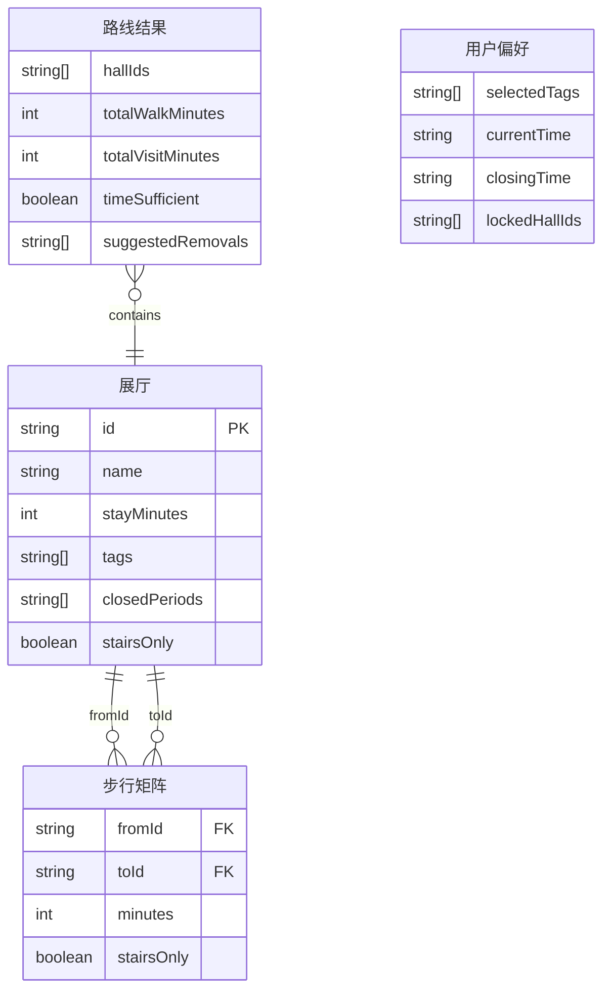

## 1. 架构设计

```mermaid
flowchart TD
    subgraph "前端"
        "UI 层" --> "状态管理 (Zustand)"
        "状态管理 (Zustand)" --> "路径算法层"
        "状态管理 (Zustand)" --> "数据层"
        "路径算法层" --> "数据层"
    end
    subgraph "数据层"
        "Mock JSON 数据" --> "展厅列表"
        "Mock JSON 数据" --> "步行矩阵"
        "Mock JSON 数据" --> "标签关联"
        "Mock JSON 数据" --> "闭厅时段"
    end
```

## 2. 技术说明

- 前端：React@18 + TypeScript + TailwindCSS@3 + Vite
- 初始化工具：vite-init（react-ts 模板）
- 后端：无（纯前端，数据使用本地 JSON mock）
- 状态管理：Zustand

## 3. 路由定义

| 路由 | 用途 |
|------|------|
| / | 路线规划主页（单页应用唯一页面） |

## 4. API 定义

不适用（纯前端，无后端 API）

## 5. 服务器架构图

不适用（纯前端项目）

## 6. 数据模型

### 6.1 数据模型定义



### 6.2 数据定义

- 展厅数据：包含 id、名称、预计停留分钟数、关联标签数组、闭厅时段数组、是否仅楼梯可达
- 步行矩阵：展厅间两两步行的分钟数与是否仅楼梯可达
- 路线结果：有序展厅 id 列表、总步行分钟、总参观分钟、时间是否充足、建议删减展厅
- 用户偏好：已选标签、当前时间、闭馆时间、锁定的展厅 id 列表

## 7. 模块结构

```
src/
├── data/                  # 数据层
│   ├── mockData.ts        # Mock JSON 数据定义
│   └── types.ts           # TypeScript 类型定义
├── algorithm/             # 路径算法层
│   └── routePlanner.ts    # 路线规划核心算法
├── store/                 # 状态管理
│   └── useAppStore.ts     # Zustand 全局状态
├── components/            # UI 组件
│   ├── PreferencePanel.tsx # 偏好设置面板
│   ├── RouteDisplay.tsx   # 路线结果展示
│   ├── HallCard.tsx       # 展厅卡片（含锁定）
│   ├── RouteDiff.tsx      # 路线差异对比
│   └── ExportButton.tsx   # 导出行程单按钮
├── App.tsx                # 主入口
└── main.tsx               # 渲染入口
```
